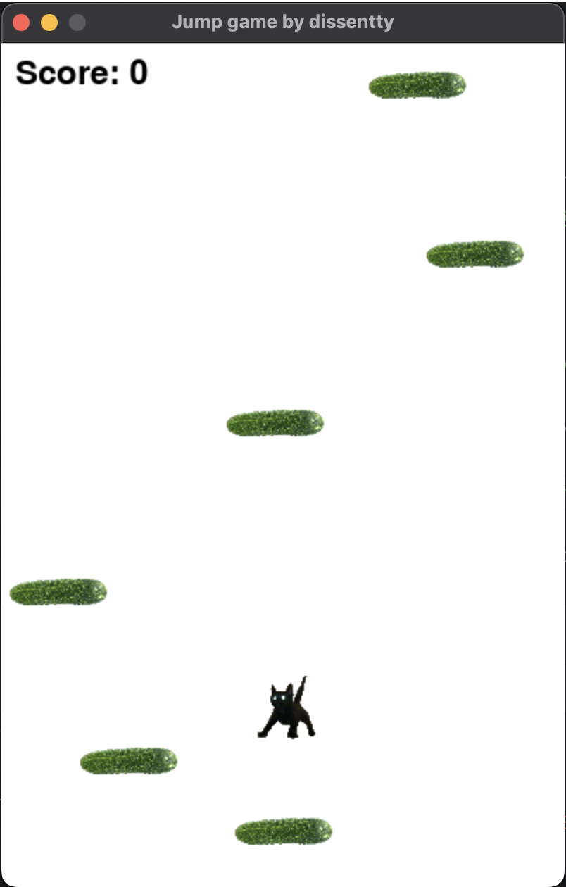

# jump game by dissentty

**jump game** — простенькая игрушка, написанная на python.
Игрок за кота должен прыгать по огурцам в попытках побить свой предыдущий результат.

## Скриншоты 

## Требования

- Python 3.x
- pygame

## Установка

1. Склонируйте репозиторий:
git clone https://github.com/Dissentty/jump_game

2. Установите необходимые зависимости:
pip install -r requirements.txt

## Запуск приложения

Для запуска приложения выполните следующую команду в терминале:
python main.py

## Лицензия

Этот проект распространяется под лицензией MIT. Подробности смотрите в файле LICENSE.

---

## Авторы

- dissentty